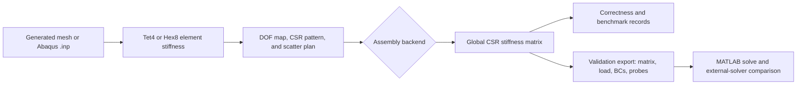

# Parallel Global Stiffness Assembly on Shared-Memory CPUs

[](https://github.com/YongleEncyclopedia/parallel-global-stiffness-assembly-research-and-implementation/actions/workflows/ci.yml)

A reproducible C++17 and OpenMP research platform for studying finite-element global stiffness matrix assembly on shared-memory multicore CPUs.

> [!IMPORTANT]
> This repository is a source-tree research platform, not a production finite-element package or a supported SDK. The top-level README is maintained in English for international research and engineering contributors; most detailed maintainer documentation is currently written in Chinese.

## Research problem

For a finite-element mesh, the element matrices $K_e$ are scattered into the global sparse stiffness matrix $K$:

$$
K = \sum_e A_e^{\mathsf T} K_e A_e,
\qquad
K u = f.
$$

The scatter operation is simple in a serial implementation but creates shared-write conflicts when multiple elements are processed concurrently. Different assembly strategies trade synchronization, preprocessing, redundant computation, temporary storage, memory traffic, and reduction cost against one another.

This repository provides a common mesh, degree-of-freedom map, CSR structure, element kernel, and scatter plan so that CPU backends can be compared on the same mathematical problem. Every candidate is evaluated against three basic dimensions:

- matrix correctness relative to the serial baseline;
- memory use, separated by allocation lifetime and measurement source;
- assembly time $t_{\mathrm{assembly}}$ under a documented execution environment.

Performance claims are accepted only when they can be traced to a versioned command, input, machine configuration, and raw result package. GitHub-hosted runner timings are not treated as formal benchmark evidence.

## Project status

| Area | Current status |
| --- | --- |
| Primary implementation | CPU-first C++17 and OpenMP code under [`cpu_parallel_stiffness_assembly`](parallel_global_stiffness_assembly/cpu_parallel_stiffness_assembly/README.md) |
| Parallel scope | Shared-memory multicore assembly; no active MPI or distributed-memory implementation |
| Tested platforms | Linux, macOS ARM64, and Windows through GitHub Actions |
| Supported elements | Tet4/C3D4 and Hex8/C3D8 |
| Canonical stiffness model | `linear_elastic_solid` |
| Build interface | Source-tree CMake project; no supported installation or package-consumer contract |
| Releases | No formal release or tag policy has been adopted |
| License | No repository license has been declared; policy is tracked in [Issue #37](https://github.com/YongleEncyclopedia/parallel-global-stiffness-assembly-research-and-implementation/issues/37) |
| Historical GPU code | Quarantined under [`legacy_gpu/`](parallel_global_stiffness_assembly/cpu_parallel_stiffness_assembly/legacy_gpu/README.md) and excluded from the default build |

## Implemented CPU assembly backends

All seven backends use the same mesh, three translational degrees of freedom per node, CSR sparsity pattern, scatter plan, and element stiffness implementation.

| CLI name | Conflict-management strategy | Storage and research role |
| --- | --- | --- |
| `serial` | Direct CSR accumulation on one thread | Correctness and speedup baseline; no synchronization buffer |
| `atomic` | OpenMP atomic update for each shared CSR entry | Low auxiliary storage; exposes atomic contention and cache-coherence costs |
| `lock_guard` | One `std::mutex` per CSR entry, acquired through `std::lock_guard` | Explicit synchronization baseline with substantial per-entry lock storage |
| `private_csr` | One private CSR value array per thread followed by deterministic reduction | Removes write conflicts during element processing at a cost proportional to thread count and `nnz` |
| `coo_sort_reduce` | Thread-private COO contributions, global sort, and reduction | High-memory research control for generate-sort-reduce assembly |
| `coloring` | Greedy element conflict coloring; each color is processed without atomics | Trades coloring preprocessing and color imbalance for conflict-free writes |
| `row_owner` | Owner-computes partitioning by CSR row | Avoids shared writes but may recompute an element for multiple row owners |

Implementation details, source locations, and maintained interpretation boundaries are documented in the [CPU assembly algorithm guide](parallel_global_stiffness_assembly/cpu_parallel_stiffness_assembly/docs/cpu/cpu_algorithms.md).

## Finite-element and input contract

| Path | Element formulation | Input support |
| --- | --- | --- |
| Tet4 | Constant-strain, four-node tetrahedron | Generated cube meshes and Abaqus `C3D4` records |
| Hex8 | Eight-node hexahedron with $2\times2\times2$ Gauss full integration | Generated cube meshes and Abaqus `C3D8` records |

The canonical CLI option is:

```text
--stiffness-model linear_elastic_solid
```

It denotes a three-dimensional, small-strain, linear-elastic solid model. The historical `physics_solid` alias maps to this model, while `physics_tet4` is restricted to Tet4/C3D4. The former synthetic smoke kernel is now gated as `legacy_synthetic`; it must be explicitly enabled and must not be used as evidence for current physical benchmark or validation conclusions.

The Abaqus `.inp` reader currently covers the node and element records needed by the maintained C3D4/C3D8 workflows. This is not a general Abaqus input-language implementation.

## Architecture and evidence flow



The main executable paths are:

- `benchmark_assembly` for direct assembly experiments;
- `symbolic_numeric_eval` for symbolic/numeric phase separation and reuse studies;
- `stiffness_pattern_export` for sparse-pattern inspection;
- `validation_export` for solver-level validation assets.

## Quick start

### Prerequisites

| Requirement | Minimum or maintained use |
| --- | --- |
| CMake | 3.20 or newer |
| C++ compiler | C++17 support |
| OpenMP | Required by the `cpu-ci` preset and every parallel backend |
| Ninja | Generator used by `cpu-ci` and `cpu-serial` |
| Python | Python 3.11 in CI; used for workflow scripts and contract tests |
| Git LFS | Required to materialize the WindHub engineering mesh and other managed large objects |

On macOS with AppleClang, Homebrew provides the complete local toolchain:

```bash
brew install cmake ninja libomp git-lfs python@3.11
```

On Windows, run the commands below from a Visual Studio x64 developer shell with CMake, Ninja, Python, and Git LFS available. On Linux, install the equivalent compiler, OpenMP runtime, CMake, Ninja, Python, and Git LFS packages from the distribution or toolchain provider.

### Clone and prepare Python

```bash
git clone https://github.com/YongleEncyclopedia/parallel-global-stiffness-assembly-research-and-implementation.git
cd parallel-global-stiffness-assembly-research-and-implementation

git lfs install

python3.11 -m venv .venv
source .venv/bin/activate
python -m pip install --upgrade pip
python -m pip install -r parallel_global_stiffness_assembly/cpu_parallel_stiffness_assembly/requirements.txt
```

On Windows, replace the virtual-environment creation command with `py -3.11 -m venv .venv`, then activate it with `.venv\Scripts\Activate.ps1`. The deterministic small tests do not require the WindHub LFS object. Materialize it before a WindHub run:

```bash
git lfs pull
```

### Configure, build, and test

Run from the CPU project directory:

```bash
cd parallel_global_stiffness_assembly/cpu_parallel_stiffness_assembly

cmake --preset cpu-ci
cmake --build --preset cpu-ci --parallel
ctest --preset cpu-ci --output-on-failure
```

The `cpu-ci` preset is a Release build with OpenMP required, warnings treated as errors, tests enabled, and benchmark executables enabled. The preset runs the maintained `ci` test inventory. To run the repository contract suite as well:

```bash
ctest --test-dir build/cpu-ci -L repository --output-on-failure
```

The Python suites can also be invoked directly:

```bash
python -m unittest discover -s tests/python/unit -v
python -m unittest discover -s tests/python/repository -v
```

For an explicit serial-only capability build:

```bash
cmake --preset cpu-serial
cmake --build --preset cpu-serial --parallel
ctest --preset cpu-serial --output-on-failure
```

The serial-only build is not allowed to present a one-thread fallback as a parallel benchmark: requesting a parallel backend without compiled OpenMP support fails with a diagnostic.

## Smoke tests and experiment profiles

### Deterministic local smoke

After building `cpu-ci`, run generated Tet4 and Hex8 meshes with one and two threads:

```bash
python scripts/run_cpu_smoke.py \
  --preset cpu-ci \
  --skip-build \
  --threads-list 1,2 \
  --out-root build/readme-smoke
```

The runner requires every requested algorithm record to report `PASS`. It refuses to overwrite an existing output directory unless `--overwrite` is supplied.

### Experiment profiles

| Profile | Input and backend scope | Intended environment |
| --- | --- | --- |
| `cube` | Generated Tet4 mesh and the standard backend set | Development smoke or controlled scaling preparation; no LFS input |
| `windhub` | Materialized `examples/3d-WindTurbineHub.inp`; `serial`, `atomic`, `lock_guard`, `private_csr`, `coloring`, and `row_owner` | Controlled physical host |
| `windhub-coo` | WindHub with `coo_sort_reduce` only | Controlled high-memory host |
| `standard` | `cube` followed by `windhub`; deliberately excludes the high-memory COO run | Controlled physical host |

A small generated-mesh experiment can reuse the existing CI build:

```bash
python scripts/run_cpu_experiments.py \
  --profile cube \
  --preset cpu-ci \
  --skip-build \
  --threads-list 1,2 \
  --out-root build/readme-cube-experiment
```

A formal run should use a new, descriptive output directory and the platform protocol appropriate to the host:

```bash
python scripts/run_cpu_experiments.py \
  --profile standard \
  --threads-all \
  --out-root results/local-standard-run
```

Each workflow records the commit, platform, compiler, OpenMP capability, thread selection, expanded commands, per-task status, and CSV/JSON outputs in a run manifest. Do not compare formal timing, speedup, efficiency, or peak-memory values unless the input, thread policy, toolchain, schema, and measurement method are compatible.

## Solver-level validation

The maintained validation workflow exports four cantilever cases:

- `cantilever_hex8_small`;
- `cantilever_hex8_medium`;
- `cantilever_tet4_small`;
- `cantilever_tet4_medium`.

For every case, C++ emits the symmetric Matrix Market stiffness matrix, force vector, boundary conditions, probes, nodes, elements, and metadata. CSV node and degree-of-freedom indices are zero-based; Matrix Market coordinates are one-based.

Export all four cases without invoking a licensed solver:

```bash
python scripts/run_validation_export.py \
  --validation-export build/cpu-ci \
  --out-root build/readme-validation-export
```

Without `--run-matlab`, the manifest correctly records an export-only workflow and `SKIPPED` solver status. A licensed MATLAB host can add:

```text
--run-matlab --matlab-bin matlab
```

The MATLAB path reconstructs the symmetric matrix, applies Dirichlet elimination, solves $K u = f$, and writes displacement and residual metadata. Abaqus, CalculiX, COMSOL, or another trusted finite-element workflow may provide an independent displacement reference. The comparator reports absolute and relative probe differences but currently applies no hard physical pass/fail threshold.

Read the [cross-platform solver validation protocol](docs/platform/cross-platform-validation-protocol.md) before interpreting results. Existing evidence packages include:

- the [macOS ARM64 four-case MATLAB smoke](parallel_global_stiffness_assembly/cpu_parallel_stiffness_assembly/results/validation-export/2026-07-10-macos-arm64-matlab-smoke/README.md);
- the [Windows AMD Abaqus validation report](parallel_global_stiffness_assembly/cpu_parallel_stiffness_assembly/results/validation-export/2026-05-26-windows-amd-abaqus/windows_amd_abaqus_validation_report.md);
- the [Linux Intel CalculiX validation report](parallel_global_stiffness_assembly/cpu_parallel_stiffness_assembly/results/validation-export/2026-05-23-linux-intel-calculix/calculix_validation_report.md).

Each package has its own completeness and interpretation boundary. Open follow-up work tracks the [COMSOL package](https://github.com/YongleEncyclopedia/parallel-global-stiffness-assembly-research-and-implementation/issues/33), [restoration of a reproducible four-case CalculiX workflow](https://github.com/YongleEncyclopedia/parallel-global-stiffness-assembly-research-and-implementation/issues/34), and [isolation of the Hex8/C3D8 free-tip discrepancy](https://github.com/YongleEncyclopedia/parallel-global-stiffness-assembly-research-and-implementation/issues/35).

## CI and reproducibility boundary

The [`CI` workflow](.github/workflows/ci.yml) runs for pull requests, pushes to `main`, and manual dispatches. The stable required jobs are `CI / Ubuntu`, `CI / macOS`, and `CI / Windows`.

| Automated in GitHub Actions | Reserved for controlled physical hosts |
| --- | --- |
| CMake configure and C++ compilation | Formal assembly timing and speedup |
| Fourteen deterministic `ci` CTest entries | Peak RSS and memory-lifecycle experiments |
| Python unit and schema/CLI contract tests | Thread affinity, NUMA, and heterogeneous-core profiles |
| Tet4 and Hex8 `linear_elastic_solid` correctness paths | WindHub full-dataset experiments |
| Repository hygiene and Markdown-link contract on Ubuntu | MATLAB and licensed external-solver validation |
| Independent CSC3 symmetric-assembly demo on Ubuntu | Cross-platform performance interpretation |

The Ubuntu job also runs the repository contract suite. CI deliberately avoids `git lfs pull`, licensed software, and formal benchmark gates. Failed jobs upload CMake and CTest diagnostics as Actions artifacts.

For controlled experiments, follow the [Linux Intel experiment protocol](docs/platform/linux-intel-experiment-protocol.md) and the [cross-platform strategy](docs/platform/cross-platform-strategy.md). Current structured evidence and reports live under the CPU project's [`results/`](parallel_global_stiffness_assembly/cpu_parallel_stiffness_assembly/results/README.md) and [`reports/`](parallel_global_stiffness_assembly/cpu_parallel_stiffness_assembly/reports/README.md) directories.

## Repository map

```text
.
├── .github/                         Issue, pull-request, and CI configuration
├── docs/                            Scope, requirements, and platform protocols
├── examples/                        Repository-level engineering input data
├── parallel_global_stiffness_assembly/
│   ├── cpu_parallel_stiffness_assembly/
│   │   ├── apps/                    CLI entry points
│   │   ├── include/                 Public build-tree headers
│   │   ├── src/                     Core, assembly, and CPU backend code
│   │   ├── scripts/                 Workflow, plotting, and validation tools
│   │   ├── tests/                   C++ and Python checks
│   │   ├── results/                 Raw and structured experiment evidence
│   │   ├── reports/                 Durable analysis and presentation assets
│   │   └── legacy_gpu/              Historical CUDA-era reference material
│   └── README.md
├── AGENTS.md                        Repository collaboration rules
└── CONTRIBUTING.md                  Issue-to-PR and evidence workflow
```

The canonical engineering mesh is [`examples/3d-WindTurbineHub.inp`](examples/3d-WindTurbineHub.inp), managed by Git LFS. Small regression inputs are stored inside the CPU project and do not require LFS materialization.

## Documentation map

The top-level landing page is English. Detailed maintainer and protocol documents are primarily Chinese; commands, schema keys, and code identifiers remain in their original form.

| Topic | Document |
| --- | --- |
| Current facts and source precedence | [Current knowledge boundary](docs/context/current-knowledge-boundary.md) |
| Research requirements and exclusions | [CPU parallel assembly design requirements](docs/requirements/cpu-parallel-stiffness-assembly-design.md) |
| Evaluation definitions | [Basic correctness, memory, and assembly-time metrics](parallel_global_stiffness_assembly/cpu_parallel_stiffness_assembly/docs/cpu/basic_evaluation_metrics.md) |
| Backend implementation details | [CPU assembly algorithms](parallel_global_stiffness_assembly/cpu_parallel_stiffness_assembly/docs/cpu/cpu_algorithms.md) |
| Platform responsibilities | [Cross-platform strategy](docs/platform/cross-platform-strategy.md) |
| Formal Linux experiment procedure | [Linux Intel experiment protocol](docs/platform/linux-intel-experiment-protocol.md) |
| Solver-level evidence contract | [Cross-platform validation protocol](docs/platform/cross-platform-validation-protocol.md) |
| Repository scope | [Repository scope](docs/context/repository-scope.md) |

Active development and experiment plans live only in GitHub Issues. Stable architecture, protocols, and decisions belong in repository documentation; raw evidence belongs in `results/`, `reports/`, or GitHub Actions artifacts.

## Contributing

Read [`CONTRIBUTING.md`](CONTRIBUTING.md) and [`AGENTS.md`](AGENTS.md) before changing code, experiments, or documentation. The required workflow is:

1. create a complete GitHub Issue using the applicable template;
2. branch from the recorded base SHA as `codex/issue-<number>-<slug>`;
3. record the machine, toolchain, planned paths, commands, and blockers;
4. make a focused change and preserve reproducible evidence;
5. submit a pull request and pass the required CI checks;
6. close the Issue only after every acceptance and close condition is met.

Do not push directly to `main`, force-push, rewrite history, or treat an Issue summary as a substitute for raw experiment evidence.

## Scope limitations

The maintained scope does not currently include:

- new CUDA/GPU backend development;
- MPI or distributed-memory assembly;
- higher-order elements, nonlinear materials, or contact;
- optimization of the linear solver after assembly;
- a general Abaqus input parser or full commercial-solver feature coverage;
- a stable binary, SDK, package installation interface, or compatibility guarantee.

Historical CUDA sources and scripts are retained only for provenance and implementation reference. They are not expected to build independently and must not be reintroduced into the default CPU path without a separately approved scope change.

## Release and license notice

The CMake project version is not a published release identifier. This repository currently has no formal release/tag policy and no declared license file. The policy decision is tracked in [Issue #37](https://github.com/YongleEncyclopedia/parallel-global-stiffness-assembly-research-and-implementation/issues/37); until it is resolved, do not describe the project as a released or licensed software package.
