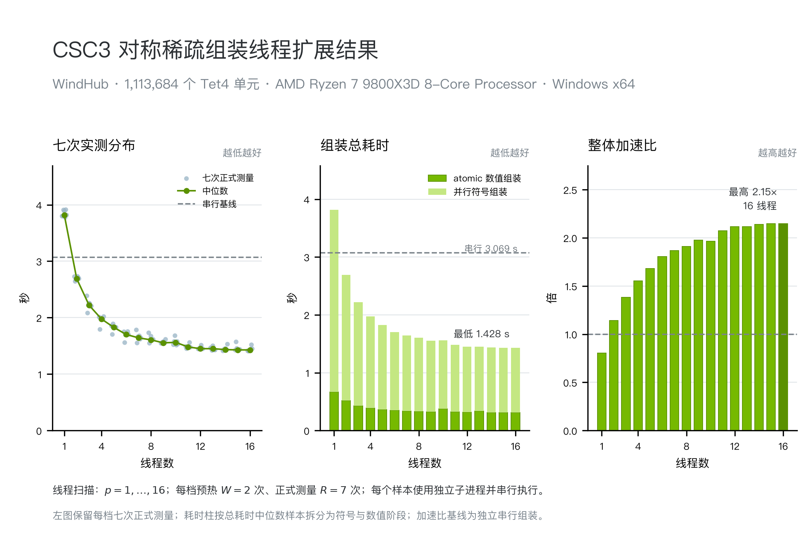

# CSC3 对称稀疏组装 Demo 测试报告（Windows，2026-07-26）

## 结论

2026 年 7 月 26 日的 Windows x64 测试通过。MSVC 和 MinGW-w64 均完成 Release 模式构建、CTest、外部调用示例和干净目录复现，OpenMP 路径实际启用。

工程网格为 WindHub，共 1,113,684 个 Tet4 单元。线程扫描覆盖 $p=1,\ldots,16$；每档预热 $W=2$ 次、正式测量 $R=7$ 次，共运行 144 个独立子进程。全部样本正常退出，实际 OpenMP 线程数与请求值一致。

矩阵结构与串行参考一致，最大相对 Frobenius 误差为 $e_F=1.510488e-16$。16 线程时总耗时中位数为 1428.320 ms，整体加速比为 $2.1490\times$，峰值内存占用中位数为 4.797 GiB。

本文数值均来自 2026-07-26 的测试记录。测试可执行文件由提交 `14d89fad3b643b0ce81047aecbddd3e1cfb504e2` 构建；后续源码改动不在本报告覆盖范围内。

## Demo 范围与接口位置

Demo 只负责生成对称 CSC3 结构并累加单元刚度矩阵，不包含网格划分、载荷处理和线性求解器。2026-07-26 测试提交的公共入口是 `SymmetricCscAssembler`，调用顺序为 `build_symbolic_parallel()` 后接 `assemble_numeric_atomic()`。

| 内容 | 仓库相对路径 |
|---|---|
| 公共接口 | `demos/csc3_symmetric_assembly_demo/include/csc3_demo/assembly_helper.h` |
| 并行实现 | `demos/csc3_symmetric_assembly_demo/src/assembly_helper.cpp` |
| benchmark | `demos/csc3_symmetric_assembly_demo/tools/src/benchmark.cpp` |
| 串行参考与误差计算 | `demos/csc3_symmetric_assembly_demo/tools/src/validation.cpp` |
| 自动测试 | `demos/csc3_symmetric_assembly_demo/tests/` |
| Windows 线程扫描脚本 | `demos/csc3_symmetric_assembly_demo/scripts/run_windows_process_benchmark.py` |

源码目录为 `demos/csc3_symmetric_assembly_demo/`。具体编译目录和命令见该目录的 `README.md`。

## 并行符号组装算法

符号阶段只确定稀疏结构和单元条目在整体矩阵中的位置，不写入刚度值。输入先按单元编号整理，同时检查自由度编号、重复项和索引范围。

1. 先建立“全局自由度到关联单元”的邻接关系；
2. 按 CSC3 列并行收集候选行号，每列由一个线程独占处理；
3. 对候选行号排序、去重，再通过前缀和生成列指针；
4. 并行写入行号，并为每个单元建立固定的 scatter 位置表。

列内结果经过排序，因此线程执行先后不会改变 CSC3 结构。散射位置表（scatter）在数值组装时直接给出目标位置，避免重复查找。

## OpenMP atomic 数值组装算法

数值阶段先检查局部矩阵尺寸、有限性、对称性和 scatter 边界，然后清零整体矩阵数值。OpenMP 按单元分工，每个线程遍历自己负责的单元，并按符号阶段给出的目标位置累加：

$$
K_{s(a,b)} \mathrel{+}=K_e(a,b),\qquad 0\le a\le b<n_e .
$$

不同单元可能同时写入同一个整体条目，所以更新点使用 `#pragma omp atomic`。atomic 保证累加不丢失；浮点加法顺序仍可能带来舍入级差异，因此正确性判断采用误差阈值，不要求逐位相同。

本报告的并行耗时为

$$
t_{\mathrm{parallel}}=
t_{\mathrm{symbolic}}+t_{\mathrm{numeric}},
$$

其中数值阶段包含检查、清零和 atomic 累加，不含网格文件读取。

## 串行参考实现

串行参考实现在 `tools/src/validation.cpp`。它从原始拓扑独立建立 CSC3 结构和数值，不调用并行组装器，也不复用并行散射位置表。两套实现分开，便于发现符号结构或累加位置上的错误。

整体加速比采用串行总耗时中位数作为基线：

$$
S_p=
\frac{\operatorname{median}_{r=1,\ldots,7}
\left(t_{\mathrm{serial,symbolic}}+
t_{\mathrm{serial,numeric}}\right)_{p=1,r}}
{\operatorname{median}_{r=1,\ldots,7}
\left(t_{\mathrm{parallel,symbolic}}+
t_{\mathrm{parallel,numeric}}\right)_{p,r}} .
$$

串行基线的中位数为 3069.451 ms，七次测量范围为 [3038.999, 3230.075] ms，变异系数为 1.96%。

## 测试环境

| 项目 | 实测值 |
|---|---|
| 操作系统 | Microsoft Windows 11 专业工作站版 10.0.26200（build 26200，64-bit） |
| CPU | AMD Ryzen 7 9800X3D 8-Core Processor |
| 物理核 / 逻辑处理器 | 8 / 16 |
| 物理内存 | 31.116 GiB |
| Python | 3.13.14 |
| 性能编译器 | MSVC 19.44.35227 |
| CMake / Ninja | 4.3.3 / 1.13.2 |
| OpenMP 运行时 | vcomp140.dll 14.51.36247.0 |
| 分支 / 提交 | `codex/issue-54-csc3-windows-delivery` / `14d89fad3b643b0ce81047aecbddd3e1cfb504e2` |
| WindHub 输入 | `examples/3d-WindTurbineHub.inp` |
| 输入大小 / SHA-256 | 76111745 bytes / `4f3066b7e388ff0abaccb41d9ff5ec5a668e8d6ed008ae0c1061951f836ae0c3` |
| Git LFS | 实体已物化且与 HEAD 指针匹配 |
| 节点 / 单元 / 自由度 | 228,384 / 1,113,684 / 685,152 |
| CSC3 非零条目 | 14,093,676 |
| 实验安排 | $p=1,\ldots,16$，$W=2$，$R=7$，每个样本独立进程且串行执行 |

| 工具链 | 编译器 | OpenMP | 配置 | 构建 | CTest | 外部调用示例 | 干净目录复现 |
|---|---|---|---:|---:|---:|---:|---:|
| MSVC + Ninja | `MSVC 19.44.35227` | `OpenMP 2.0 / vcomp140.dll 14.51.36247.0` | PASS | PASS | PASS | PASS | PASS |
| MinGW-w64 + Ninja | `GCC 16.1.0` | `OpenMP 5.2 / libgomp` | PASS | PASS | PASS | PASS | PASS |

完整命令和日志保存在 2026-07-26 结果目录的 `builds/` 与 `performance/` 中，报告不再重复粘贴大段终端输出。

## 矩阵正确性

32 个预热样本和 112 个正式样本均通过以下检查：

- CSC3 列指针和行号与串行参考逐项一致；
- 所有矩阵值有限，scatter 索引均在合法范围内；
- 最大相对 Frobenius 误差为 $e_F=1.510488e-16\le 10^{-8}$；
- 全部样本的最大绝对误差不超过 $e_{\max}=7.812500e-03$。

误差定义为

$$
e_F=\frac{\lVert K_p-K_s\rVert_F}
{\max(\lVert K_s\rVert_F,10^{-30})} ,
$$

其中非对角项按完整对称矩阵计入两次。WindHub 输入只包含节点和单元，本次工程网格测试没有设置载荷和边界条件，因此不做位移比较。

## 不同线程数下的内存、时间和加速比

并行路径在 1 线程时有额外开销，速度低于独立串行基线；从 2 线程开始出现整体加速，14 至 16 线程基本进入平台区。各线程数的峰值内存占用中位数为 4.796535 至 4.796970 GiB，最大相差 0.445 MiB，没有出现随线程数增长的大块内存开销。

左图保留每个线程数下七次正式测量的散点，并用折线连接各档中位数。中图的耗时柱取总耗时位于中间的那次实测，再拆成符号和数值阶段，因此两段之和就是柱顶总耗时。右图的加速比以串行总耗时中位数为基线。图像质量记录见 [`figure_qa.json`](figures/figure_qa.json)。

| 线程数 $p$ | 符号组装中位数（ms） | atomic 数值组装中位数（ms） | 总耗时中位数（ms） | 总耗时 $CV$ | 整体加速比 | 峰值内存占用（GiB） |
|---:|---:|---:|---:|---:|---:|---:|
| 1 | 3149.959 | 672.233 | 3818.043 | 1.38% | 0.8039 | 4.7965 |
| 2 | 2184.590 | 519.962 | 2690.539 | 1.13% | 1.1408 | 4.7967 |
| 3 | 1789.117 | 431.110 | 2220.227 | 3.75% | 1.3825 | 4.7967 |
| 4 | 1589.406 | 388.687 | 1976.094 | 3.62% | 1.5533 | 4.7967 |
| 5 | 1466.900 | 361.684 | 1827.358 | 2.93% | 1.6797 | 4.7968 |
| 6 | 1352.356 | 346.407 | 1701.651 | 3.57% | 1.8038 | 4.7968 |
| 7 | 1302.724 | 348.204 | 1641.811 | 3.93% | 1.8696 | 4.7968 |
| 8 | 1272.345 | 334.779 | 1606.406 | 3.39% | 1.9108 | 4.7969 |
| 9 | 1226.815 | 334.854 | 1554.262 | 1.41% | 1.9749 | 4.7968 |
| 10 | 1214.251 | 328.451 | 1561.526 | 3.34% | 1.9657 | 4.7969 |
| 11 | 1155.017 | 324.544 | 1481.287 | 2.11% | 2.0722 | 4.7968 |
| 12 | 1130.206 | 320.241 | 1450.051 | 1.54% | 2.1168 | 4.7969 |
| 13 | 1115.520 | 319.113 | 1450.661 | 1.80% | 2.1159 | 4.7969 |
| 14 | 1114.828 | 322.498 | 1433.908 | 2.53% | 2.1406 | 4.7969 |
| 15 | 1119.152 | 311.870 | 1428.837 | 3.41% | 2.1482 | 4.7969 |
| 16 | 1118.472 | 309.848 | 1428.320 | 2.47% | 2.1490 | 4.7970 |

表中的符号、数值和总耗时分别统计中位数，分项中位数之和可能与总耗时中位数略有差别。`estimated_persistent_bytes` 为 0.880 GiB，只表示程序持有的向量容量估计；峰值内存占用由 Windows 接口 `GetProcessMemoryInfo().PeakWorkingSetSize` 实测。

原始逐样本数据见 [`benchmark_samples.csv`](../../results/2026-07-26-windows-x64-issue-54/performance/benchmark_samples.csv)，汇总结果见 [`benchmark_summary.json`](../../results/2026-07-26-windows-x64-issue-54/performance/benchmark_summary.json)，进程、输入和文件摘要见 [`run_manifest.json`](../../results/2026-07-26-windows-x64-issue-54/performance/run_manifest.json)。后续如果更换源码提交、编译器或主机，应重新运行这套线程扫描，不能沿用本报告数值。
