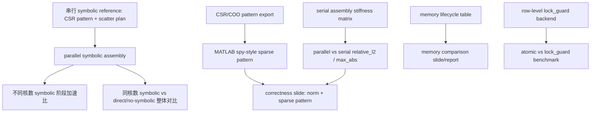

# 2026-05-14 Mentor 例会行动清单

> 内部自用。本文不是会议纪要，也不复述完整录屏内容；本版按 mentor 会后确认的 5 条主线重写，旧版 A1-A7 只吸收为当前状态、依赖和验收标准。

## 读取边界

- 资料源：腾讯会议云录制页 `https://meeting.tencent.com/cw/NxOpa8dd2a` 的官方纪要、官方时间轴和逐字稿可视片段；以及会后 mentor 对 5 条任务的文字修订。
- 会议信息：`Haohua Jiang预定的会议`，会议时间 `2026/05/14 14:32`，会议主题为有限元并行组装算法性能评估与优化讨论。
- 附件图口径：mentor 给出的图片是 MATLAB `spy` 风格 sparse pattern 示例，左图类似 `spy(B)`，右图类似 `spy(B(p,p))`，只作为稀疏模式展示目标，不是本项目计算结果。
- 本地对照范围：当前 `cpu_parallel_stiffness_assembly` 子项目、symbolic/numeric assembly 文档、已有 correctness/memory figures、Intel/Apple cross-platform benchmark、mentor next-step Beamer package。
- 证据约束：不保存完整逐字稿；只保留时间戳、短引文或会后修订摘要用于定位证据。
- 安全边界：只读查看会议官方文字内容；未读取 cookies、local storage、密码或无关标签页，未发送、分享、删除或修改腾讯会议内容。
- 输出边界：不安排时间表；只给任务池、优先级、依赖关系和验收标准。

## 状态标签

- `Done`：当前仓库已有可复用材料或实现，后续主要是引用/整理。
- `Partial`：已有一部分，但不足以满足 mentor 最新口径。
- `Missing`：当前仓库未发现对应实现、结果或报告。
- `Unclear`：录屏、会后文字或仓库状态不足以可靠判断，需要补充材料或实验。

## 一页结论

| 优先级 | mentor 会后主线 | 当前状态 | 关键依赖 | 最小验收 |
| --- | --- | --- | --- | --- |
| P0 | 符号组装阶段并行化 | `Missing` | 串行 CSR/scatter plan 作为 reference | 并行 symbolic 输出与串行一致，并报告不同核数加速比 |
| P0 | 正确性验证：相对误差 + 整体刚度稀疏模式 | `Partial` | CSR/COO pattern 导出与 spy 图生成 | 单独一页同时展示 `relative_l2/max_abs` 和 sparse pattern |
| P1 | 内存占用情况对比 | `Partial / Unclear` | 明确 persistent/transient 口径 | 对比 symbolic artifacts、direct/no-symbolic transient buffer、parallel symbolic 临时结构、numeric assembly extra memory |
| P0 | 并行环境下 symbolic vs direct/no-symbolic | `Missing / Partial` | 先实现 parallel symbolic evaluation | 同核数下比较整体耗时、symbolic 阶段、numeric 阶段和摊销收益 |
| P0 | OpenMP atomic vs `lock_guard` baseline | `Missing` | 新增 C++ mutex lock backend | 现有 `cpu_atomic` 与 `std::lock_guard<std::mutex>` baseline 在同一 benchmark schema 下对比 |

## 依赖关系

## Mentor 会后确认的 5 条主线

### 1. 符号组装阶段并行化

- 优先级：`P0`
- 状态：`Missing`
- 来源类型：会后任务 1；腾讯会议时间轴 `20:15`、`46:53`
- mentor 最新口径：重点回答“符号组装阶段能否并行化、并行效果如何”，不能只沿用串行 symbolic/numeric 对比。
- 当前状态：
  - `docs/cpu/symbolic_numeric_assembly.md` 已固定术语：符号组装是拓扑、DOF、CSR 稀疏结构和 scatter 写入位置预计算。
  - `results/2026-05-11-symbolic-numeric/symbolic_numeric_eval_report.md` 已有串行 `symbolic_reuse_serial`、`symbolic_rebuild_serial`、`direct_no_symbolic_serial`。
  - `src/assembly/symbolic_numeric_eval.cpp` 中 `build_symbolic_artifacts()` 仍串行调用 `CsrMatrix::build_sparsity()` 和 `build_assembly_plan()`。
  - `src/core/csr_matrix.cpp` 通过每行收集 DOF、排序、去重、生成 CSR；`src/assembly/assembly_plan.cpp` 逐元素调用 `csr.find_position()` 生成 scatter。
- 下一步行动：
  - 把 symbolic 阶段拆成两个可测子阶段：`CSR pattern build` 与 `scatter plan build`。
  - 新增并行 symbolic prototype，输出仍保持与串行 `CsrMatrix` / `AssemblyPlan` 完全同构。
  - thread/core sweep 至少覆盖 `1,2,4,8,...` 到当前平台物理核心上限，报告不同核数加速比。
  - 报告同时给出 CSR build、scatter plan build、symbolic total 三类耗时，不只给总时间。
- 依赖/风险：
  - `std::vector<std::vector<Index>> rows` 不能直接多线程写，需要重新设计 row-local 或 two-pass counting 路径。
  - 并行 symbolic 不能破坏 deterministic row order，否则后续 correctness 和 sparse pattern 对照会变复杂。
  - 并行化可能换来额外临时内存，必须和任务 3 联动解释。
- 验收标准：
  - 并行 symbolic 输出的 `row_offsets`、`col_indices`、`AssemblyPlan::dofs`、`AssemblyPlan::scatter` 与串行 reference 逐项一致。
  - 真实 WindHub mesh 上有不同核数加速比表和图。
  - 下游 numeric assembly 仍能通过 serial baseline correctness check。

### 2. 正确性验证：相对误差 + 整体刚度稀疏模式

- 优先级：`P0`
- 状态：`Partial`
- 来源类型：会后任务 2；附件 sparse pattern 示例；腾讯会议时间轴 `46:53`
- mentor 最新口径：正确性验证需要单独一页幻灯片展示，并行组装后的总体刚度矩阵与串行组装后的总体刚度矩阵之间的相对误差，以及整体刚度矩阵稀疏模式。
- 当前状态：
  - 现有 benchmark 已有 `relative_l2`、`max_abs` correctness 字段。
  - `results/2026-04-28-12charts-repeat3-threads1to14/presentation_charts_12_v2/*correctness_heatmap*` 已有 correctness heatmap。
  - 当前仓库未发现面向总刚度矩阵的 CSR/COO sparse pattern 导出脚本，也未发现 MATLAB `spy` 图。
- 下一步行动：
  - 增加 CSR/COO pattern 导出工具，最低只导出 `(row, col)` pattern；必要时再导出 `(row, col, value)`。
  - 生成项目自己的 MATLAB `spy` 风格图：至少包含 `spy(K_serial)` 与 `spy(K_parallel)` 或同一 sparse pattern 对照。
  - 图中标注 matrix size、`nnz`、case、kernel、algorithm、threads/core count。
  - 若 mentor 提供或代码中生成 permutation `p`，再补 `spy(K(p,p))`；否则不强行承诺 reordering 图。
- 依赖/风险：
  - 大规模 WindHub matrix 的 full COO value 导出可能很大；默认优先 pattern-only。
  - 稀疏模式图用于结构直觉验证，不替代 `relative_l2/max_abs`。
  - Abaqus external stiffness matrix 暂不作为本轮主验收，除非后续拿到 reference matrix、DOF ordering 和材料参数口径。
- 验收标准：
  - 一页 correctness slide/report 同时包含 `relative_l2`、`max_abs` 和 sparse pattern 图。
  - sparse pattern 图由本项目 CSR/COO 数据生成，不使用 mentor 附件图冒充项目结果。
  - small case 和 WindHub case 至少各有一组可复现导出命令或脚本入口。

### 3. 内存占用情况对比

- 优先级：`P1`
- 状态：`Partial / Unclear`
- 来源类型：会后任务 3；腾讯会议时间轴 `03:51`、`12:45`、`25:34`
- mentor 最新口径：需要比较符号组装与直接组装的内存占用，并把 parallel symbolic 后新增的临时结构单独说明。
- 当前状态：
  - `src/core/csr_matrix.cpp` 在每行排序去重后得到精确 `nnz`，再 `reserve(nnz)` 生成 `col_indices`。
  - `src/assembly/assembly_plan.cpp` 对 `dofs` 和 `scatter` 使用按单元 DOF 数累计的 `reserve`。
  - `src/backends/cpu/private_csr_assembler.cpp` 的额外内存是每线程私有 `values` 数组，近似 `threads * nnz * sizeof(Real)`。
  - `src/backends/cpu/coo_sort_reduce_assembler.cpp` 和 direct/no-symbolic 评估都有 transient contribution buffer，不能与 persistent CSR structure 混写。
- 下一步行动：
  - 做 memory lifecycle 表，列出 `CSR structure`、`CSR values`、`AssemblyPlan dofs/scatter`、`direct/no-symbolic contributions`、`parallel symbolic temporary rows/counts`、`private CSR values`。
  - 每项标注 `persistent / transient`、`exact / reserved / estimated`、bytes 公式、来源字段。
  - 对比图不要只画 peak number，要分组显示 symbolic artifacts、direct/no-symbolic transient buffer、numeric assembly extra memory。
  - 把 `coo_sort_reduce` 的 transient sort-reduce buffer 和 `private_csr` 的 per-thread values 区分开。
- 依赖/风险：
  - OS-level peak RSS 与代码估算字段不是同一个口径，不能混为一个指标。
  - parallel symbolic 的临时内存要等实现后补真实数据；行动清单中先标为待测。
- 验收标准：
  - 报告能直接回答“组装前是否知道 CSR 长度”和“2.39 GiB 这类数字是 transient 还是 persistent”。
  - 每个 memory 数字都有生命周期、公式或字段来源。
  - symbolic vs direct/no-symbolic 内存对比不遗漏 parallel symbolic 新增临时结构。

### 4. 并行环境下 symbolic vs direct/no-symbolic 对比

- 优先级：`P0`
- 状态：`Missing / Partial`
- 来源类型：会后任务 4；mentor 对第 4 点的会后修订
- mentor 最新口径：第 4 点主要看 symbolic assembly 如果可以并行，不同核数的加速比如何；同样核数下是不是优于现在 direct/no-symbolic 组装算法。
- 当前状态：
  - 已有串行 `symbolic_reuse_serial` vs `direct_no_symbolic_serial` 结果，说明多次组装场景下 symbolic reuse 收益明显。
  - 现有 `cpu_coo_sort_reduce` 是并行 thread-local COO generation + global sort/reduce 路线，但它仍复用预计算 scatter index；不能直接等同于“完全无 symbolic 的 direct/no-symbolic”。
  - 当前缺少 parallel symbolic 后的端到端对比：`parallel symbolic build + numeric assembly` vs `direct/no-symbolic`。
- 下一步行动：
  - 新增 parallel symbolic evaluation matrix：threads/core count、assemblies per symbolic、CSR build、scatter plan、numeric assembly、amortized total。
  - 在同一 threads/core count 下比较 `parallel_symbolic_reuse` 与 `direct_no_symbolic_parallel` 或明确标注当前只能比较到 `cpu_coo_sort_reduce` proxy。
  - 对 single assembly 与 repeated assemblies 分开报，不把摊销收益混进单次组装结论。
  - 输出 speedup 口径至少包括：symbolic 阶段自加速比、端到端相对串行 symbolic、同核数相对 direct/no-symbolic。
- 依赖/风险：
  - 若短期没有真正 parallel direct/no-symbolic，需要在报告中明确 proxy 边界，不能把 `cpu_coo_sort_reduce` 写成完全无 symbolic。
  - 同核数比较必须使用同一 mesh、kernel、编译器、OpenMP 设置、线程绑定策略和 memory limit。
- 验收标准：
  - 表格或图中显式出现“不同核数加速比”。
  - 表格或图中显式出现“同核数下是否优于 direct/no-symbolic”。
  - 结果拆分 symbolic build、numeric assembly、sort/reduce 或 direct generation 成本，能解释胜负原因。

### 5. OpenMP atomic vs `lock_guard` baseline

- 优先级：`P0`
- 状态：`Missing`
- 来源类型：会后任务 5；mentor 对第 5 点的会后修订；腾讯会议时间轴 `29:36`、`46:53`
- mentor 最新口径：在 `lock_guard`、`unique_lock`、`shared_lock` 三个 C++ lock 选择中挑一个与原子方案对比；本轮选择 `std::lock_guard<std::mutex>`。
- 当前状态：
  - `src/backends/cpu/atomic_assembler.cpp` 已有 OpenMP `atomic update` baseline。
  - 当前 `AlgorithmType`、`AssemblerFactory` 和 CMake 算法集合未包含 mutex/lock baseline。
  - `rg` 未发现 CPU 端 `std::mutex`、`std::lock_guard`、`std::unique_lock`、`std::shared_lock` 或 OpenMP lock backend。
- 下一步行动：
  - 新增 C++ mutex baseline，建议命名为 `cpu_lock_guard`。
  - 默认采用 row-level mutex + `std::lock_guard<std::mutex>`：每个 global CSR row 一个 mutex，写该 row 的局部贡献时独占保护。
  - 不同时实现 `unique_lock` 和 `shared_lock`；文档中说明 `shared_lock` 不适合写入，`unique_lock` 的延迟/提前解锁能力当前不是必要变量。
  - 与 `cpu_atomic` 使用同一 mesh、kernel、threads/core count、OpenMP 设置、correctness baseline 和 memory reporting。
- 依赖/风险：
  - per-entry mutex 可能内存过大；global mutex 会退化成几乎串行；row-level mutex 是本轮默认折中。
  - `lock_guard` baseline 可能比 atomic 慢，但这本身是有效对照结果。
  - 文档中不要把 OpenMP `atomic update` 称为 “atomic lock”；它是原子更新 baseline。
- 验收标准：
  - `benchmark_assembly` 或等价入口可以运行 `atomic,lock_guard` 对比。
  - `cpu_lock_guard` correctness 为 `PASS`，输出 `relative_l2`、`max_abs`。
  - 报告包含 time、speedup、extra memory、diagnostics 和 lock granularity。

## 旧版条目的归并与降级

- 旧版 P/E-core 解释边界降为报告口径提醒：后续 benchmark 仍要区分 physical-core、oversubscription、Intel `taskset` 和 Apple QoS，但它不再是 mentor 会后 5 条主任务。
- 旧版“局部刚度如何写入全局 CSR”的代码链路并入任务 1、2、4：在 symbolic/scatter plan 和 correctness 说明中解释 `Ke(i,j) -> scatter -> values[p]`。
- 旧版 Abaqus external reference matrix 降为 optional future evidence：本轮主验收是 serial assembly baseline + sparse pattern；没有 reference matrix 时不承诺 Abaqus 对照。
- 旧版“保留无符号 direct sort-reduce 作为对照”并入任务 4：必须明确 direct/no-symbolic 与 `cpu_coo_sort_reduce` proxy 的边界。

## 当前材料对照表

| 材料/路径 | 能支持的 mentor 最新主线 | 状态 | 缺口 |
| --- | --- | --- | --- |
| `docs/cpu/symbolic_numeric_assembly.md` | symbolic/numeric 术语、C++ 与 mentor MATLAB 示例对应 | `Done` | 不含 parallel symbolic 设计 |
| `results/2026-05-11-symbolic-numeric/symbolic_numeric_eval_report.md` | 串行 symbolic reuse vs direct/no-symbolic 基线 | `Done` | 不含并行 symbolic 与同核数对比 |
| `src/assembly/symbolic_numeric_eval.cpp` | symbolic artifacts 构建与 serial evaluation | `Partial` | `build_symbolic_artifacts()` 仍串行 |
| `src/backends/cpu/atomic_assembler.cpp` | OpenMP atomic update baseline | `Partial` | 缺 `cpu_lock_guard` baseline |
| `src/backends/cpu/coo_sort_reduce_assembler.cpp` | thread-local COO generation + global sort/reduce proxy | `Partial` | 仍复用 scatter index，不能直接等同完全无 symbolic |
| `src/backends/cpu/private_csr_assembler.cpp` | per-thread CSR values 内存口径 | `Done` | 需要并入 memory lifecycle 表 |
| `results/2026-04-28-12charts-repeat3-threads1to14/presentation_charts_12_v2/*correctness*` | `relative_l2/max_abs` 正确性热图 | `Partial` | 缺 MATLAB `spy` 风格 sparse pattern |
| `reports/2026-05-14-mentor-next-steps-beamer/` | 当前汇报材料汇总、已有 figures 打包 | `Partial` | 不含会后 5 条主线的新结果 |

## 下一步交付物清单

### 必须新增

- parallel symbolic assembly prototype。
- parallel symbolic evaluation report：不同核数加速比、CSR build、scatter plan、symbolic total。
- symbolic vs direct/no-symbolic parallel comparison report：同核数端到端对比和摊销收益。
- CSR/COO pattern export 工具或脚本。
- MATLAB `spy` 风格 stiffness matrix sparse pattern figure。
- correctness slide/report v2：`relative_l2/max_abs` + sparse pattern。
- memory lifecycle note：persistent/transient、exact/reserved/estimated、bytes formula/source。
- `cpu_lock_guard` 或等价 `std::lock_guard<std::mutex>` backend。
- atomic vs `lock_guard` benchmark report。

### 应更新

- `docs/cpu/symbolic_numeric_assembly.md`：加入 parallel symbolic 设计边界和同核数对比口径。
- `docs/cpu/cpu_algorithms.md`：加入 `cpu_lock_guard` baseline 说明。
- `results/cross-platform-v1/cross_platform_schema_report.md`：接入新结果时继续保留 physical-core / affinity / QoS guardrails。
- `reports/2026-05-14-mentor-next-steps-beamer/asset_manifest.md`：仅在新图真实存在后更新。

### 暂不承诺

- 不承诺 AMD SMT 结论，除非有完整 AMD benchmark。
- 不承诺 Abaqus external matrix 对照，除非 reference matrix、DOF ordering 和材料参数齐全。
- 不同时实现 `unique_lock` 和 `shared_lock`。
- 不把 mentor 附件图片作为项目结果图使用。

## 验收检查清单

- 主体只有 mentor 会后确认的 5 条主线。
- 每条主线都包含 `mentor 最新口径`、`当前状态`、`下一步行动`、`依赖/风险`、`验收标准`。
- 第 4 条明确包含“不同核数加速比”和“同核数下是否优于 direct/no-symbolic”。
- 第 5 条明确使用 `std::lock_guard<std::mutex>`，并说明不选择 `unique_lock` / `shared_lock` 的原因。
- 正确性验证明确目标图是 MATLAB `spy` 风格 sparse pattern，不是普通 heatmap。
- 文档没有给截止日期、周计划或时间表。
- 文档不包含完整逐字稿或长篇会议转录。
- 所有推导建议都能在本地文件或结果资产中找到依据。
