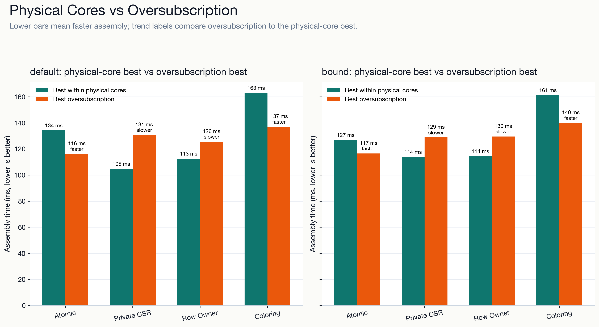
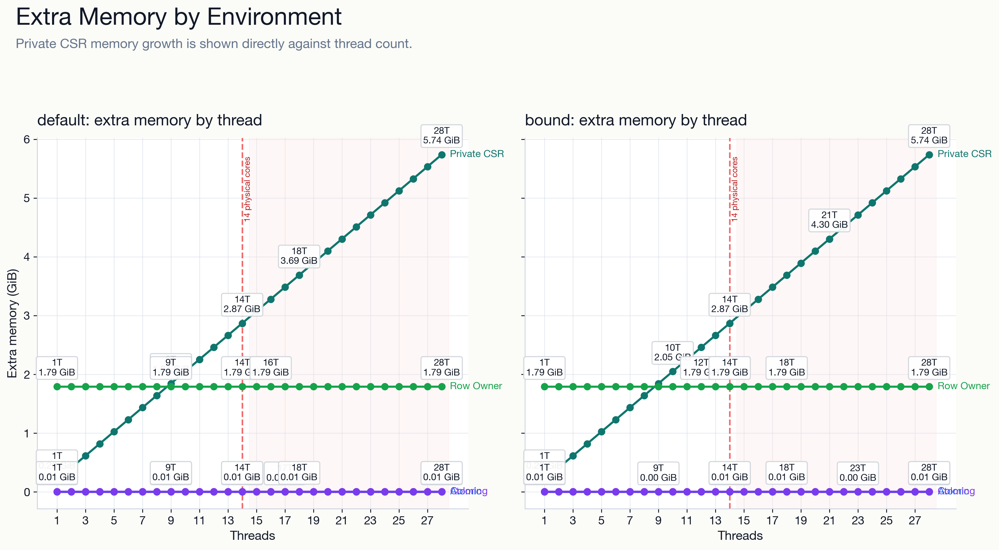
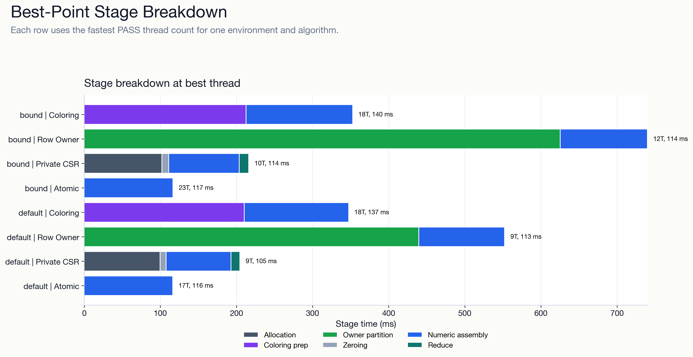
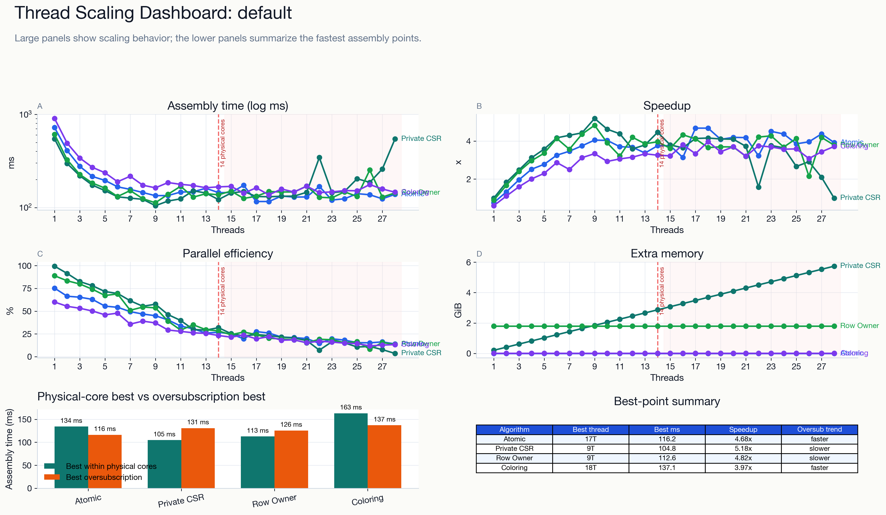
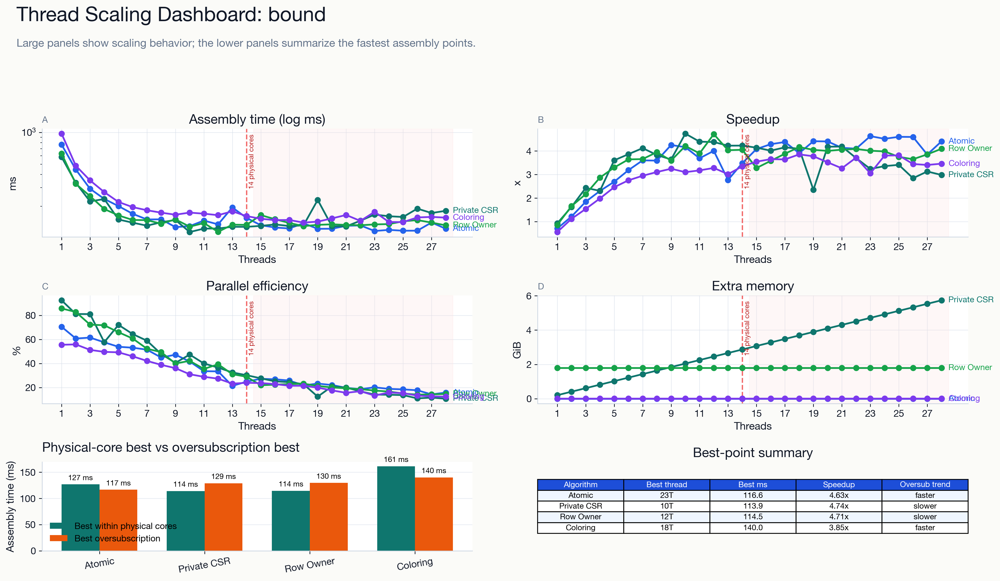

# 物理核/超物理线程扩展评估报告

## 实验设置

- case: `3d-WindTurbineHub`
- kernel: `physics_tet4`
- CPU: `Apple M4 Max`，physical_cores=14，logical_cores=14
- 线程范围: `1..28`
- 算法范围: `atomic`, `private_csr`, `row_owner`, `coloring`
- 判定阈值: 超过物理核后的最佳组装时间相对物理核内最佳值改善/退化超过 `5%`，分别判为继续加速/变慢；否则判为基本持平。

## 核区间定义

- 物理核内扩展区间: `1..14`。
- 当前平台 `physical_cores == logical_cores == 14`，没有 SMT/超线程暴露出来的真实逻辑核区间。
- 超过物理核后的区间: `15..28`，在本机语义上是 oversubscription，不是真实逻辑核加速。

<!-- thread-scaling-figures:start -->
## Presentation Figures

Core benchmark figures are stored in `figures/`. PNG files are embedded for Markdown viewing; SVG files are kept for editable, high-resolution inspection.

### Key Comparisons and Bottlenecks

[physical vs oversubscription SVG](figures/thread_scaling_physical_vs_oversubscription.svg)

[extra memory by environment SVG](figures/thread_scaling_memory_by_env.svg)

[stage breakdown best SVG](figures/thread_scaling_stage_breakdown_best.svg)

The complete figure index is available at [figures/summary.md](figures/summary.md).

<!-- thread-scaling-figures:end -->

## 主结论

### 环境组 `default`

<!-- thread-scaling-default-dashboard:start -->

[default dashboard SVG](figures/thread_scaling_default_dashboard.svg)

<!-- thread-scaling-default-dashboard:end -->

- OpenMP 设置: 默认调度，脚本运行时清空 `OMP_DYNAMIC` / `OMP_PROC_BIND` / `OMP_PLACES`。

| 算法 | 物理核内最佳 | 物理核内自扩展 | 超过物理核后最佳 | 趋势 | 主要瓶颈 |
| --- | --- | ---: | --- | --- | --- |
| `cpu_atomic` | `9T`, 134.273 ms, serial speedup 4.047x | 5.378x | `17T`, 116.246 ms, serial speedup 4.675x | 继续加速 | 主要瓶颈是共享 CSR value 上的 atomic update、缓存一致性流量和热点写入竞争；线程超过物理核后，同一批写热点会被更多软件线程竞争。 |
| `cpu_private_csr` | `9T`, 104.840 ms, serial speedup 5.184x | 5.217x | `18T`, 130.781 ms, serial speedup 4.155x | 变慢 | 主要瓶颈是每线程一份 CSR values 带来的内存容量、清零和 reduction 成本；线程越多，额外内存和归并带宽压力越明显。 |
| `cpu_row_owner` | `9T`, 112.634 ms, serial speedup 4.825x | 5.429x | `16T`, 125.580 ms, serial speedup 4.328x | 变慢 | 主要瓶颈是 owner 划分后的负载均衡、任务列表内存，以及跨 owner 单元重复计算局部刚度矩阵；超过物理核后重复计算更难换来真实执行资源。 |
| `cpu_graph_coloring` | `9T`, 163.014 ms, serial speedup 3.334x | 5.557x | `18T`, 137.059 ms, serial speedup 3.965x | 继续加速 | 主要瓶颈是颜色组之间的串行屏障、颜色桶负载不均和每个颜色内部可并行元素数量不足；线程增加后容易受同步和短任务调度限制。 |

### 环境组 `bound`

<!-- thread-scaling-bound-dashboard:start -->

[bound dashboard SVG](figures/thread_scaling_bound_dashboard.svg)

<!-- thread-scaling-bound-dashboard:end -->

- OpenMP 设置: `OMP_DYNAMIC=FALSE`, `OMP_PROC_BIND=close`, `OMP_PLACES=cores`。

| 算法 | 物理核内最佳 | 物理核内自扩展 | 超过物理核后最佳 | 趋势 | 主要瓶颈 |
| --- | --- | ---: | --- | --- | --- |
| `cpu_atomic` | `9T`, 126.886 ms, serial speedup 4.253x | 6.034x | `23T`, 116.568 ms, serial speedup 4.629x | 继续加速 | 主要瓶颈是共享 CSR value 上的 atomic update、缓存一致性流量和热点写入竞争；线程超过物理核后，同一批写热点会被更多软件线程竞争。 |
| `cpu_private_csr` | `10T`, 113.933 ms, serial speedup 4.736x | 5.122x | `21T`, 128.848 ms, serial speedup 4.188x | 变慢 | 主要瓶颈是每线程一份 CSR values 带来的内存容量、清零和 reduction 成本；线程越多，额外内存和归并带宽压力越明显。 |
| `cpu_row_owner` | `12T`, 114.460 ms, serial speedup 4.714x | 5.502x | `18T`, 129.551 ms, serial speedup 4.165x | 变慢 | 主要瓶颈是 owner 划分后的负载均衡、任务列表内存，以及跨 owner 单元重复计算局部刚度矩阵；超过物理核后重复计算更难换来真实执行资源。 |
| `cpu_graph_coloring` | `14T`, 161.281 ms, serial speedup 3.346x | 6.028x | `18T`, 139.994 ms, serial speedup 3.854x | 继续加速 | 主要瓶颈是颜色组之间的串行屏障、颜色桶负载不均和每个颜色内部可并行元素数量不足；线程增加后容易受同步和短任务调度限制。 |

## 解释边界

本报告只回答 CPU 并行组装算法在物理核内和超过物理核后的线程扩展表现；它不重开符号/无符号组装主线，也不把 `coo_sort_reduce` 纳入本次 full matrix。在当前 Apple M4 Max 上，超过 14 线程代表软件线程过量订阅，不能被解读为 SMT 逻辑核收益。
