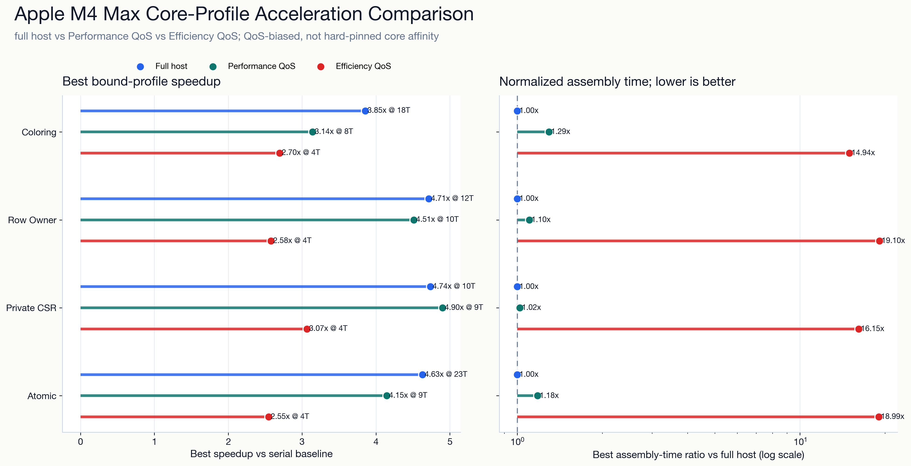
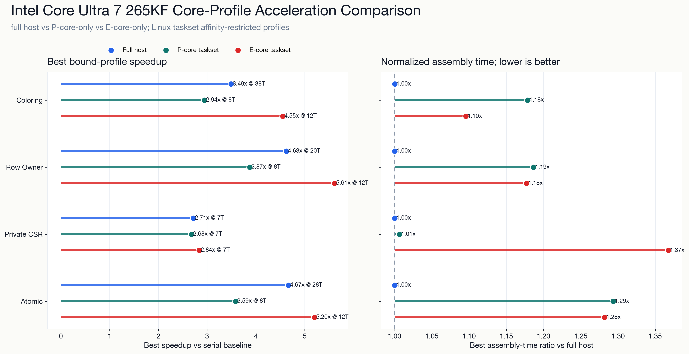

# 中文阅读说明

本文件已纳入中文维护规范。下面保留的英文标识主要是命令、路径、schema key、算法名、图表文件名、历史输出或自动生成字段；这些内容需要与脚本和结果文件保持一致，不应为了翻译而改名。人工阅读时请以本说明和相邻 `README.md` 的中文目录说明为准。

- 文件角色：`parallel_global_stiffness_assembly/cpu_parallel_stiffness_assembly/results/cross-platform-v1/cross_platform_schema_report.md`
- 维护边界：只描述来源、结构和结果字段，不把历史结果改写成新的 benchmark 结论。

## 原始内容

# Cross-Platform CPU Benchmark Schema Report

This report checks schema compatibility, baseline completeness, and interpretation guardrails.
It is not a platform performance ranking.

## Guardrails

- Do not interpret hardware, compiler, operating-system, affinity, or OpenMP runtime differences as pure algorithm differences.
- Do not compare incomplete platform profiles as if they were complete CPU characterizations.
- Treat `full_host`, `performance_core_only`, and `efficiency_core_only` as resource profiles under one CPU platform, not separate CPU models.

## Packages

| Platform | Run profile | CPU model | Records | Profile status |
| --- | --- | --- | ---: | --- |
| `apple-m4-max` | `full_host` | `Apple M4 Max` | 224 | full_host=available, performance_core_only=available, efficiency_core_only=available |
| `apple-m4-max` | `performance_core_only` | `Apple M4 Max` | 80 | full_host=available, performance_core_only=available, efficiency_core_only=available |
| `apple-m4-max` | `efficiency_core_only` | `Apple M4 Max` | 32 | full_host=available, performance_core_only=available, efficiency_core_only=available |
| `intel-u7-265kf` | `full_host` | `Intel(R) Core(TM) Ultra 7 265KF` | 320 | full_host=available, performance_core_only=available, efficiency_core_only=available |
| `intel-u7-265kf` | `performance_core_only` | `Intel(R) Core(TM) Ultra 7 265KF` | 64 | full_host=available, performance_core_only=available, efficiency_core_only=available |
| `intel-u7-265kf` | `efficiency_core_only` | `Intel(R) Core(TM) Ultra 7 265KF` | 96 | full_host=available, performance_core_only=available, efficiency_core_only=available |

## Validation

- No schema errors or completeness warnings.

## Current Interpretation Boundary

The package set is ready for merge/compatibility checks only. A performance conclusion table should be written only after each target CPU has its required `full_host` result and all applicable conditional core profiles are present or explicitly marked `not_applicable`.

<!-- core-profile-comparison-figures:start -->
## Core-Profile Acceleration Figures

The figures compare `full_host`, `performance_core_only`, and `efficiency_core_only` within each CPU platform using the `bound` environment and each algorithm's best assembly-time point.

### Apple M4 Max

[Apple M4 Max SVG](figures/core_profile_speedup_comparison_apple_m4_max.svg)

### Intel Core Ultra 7 265KF

[Intel Core Ultra 7 265KF SVG](figures/core_profile_speedup_comparison_intel_u7_265kf.svg)
<!-- core-profile-comparison-figures:end -->
